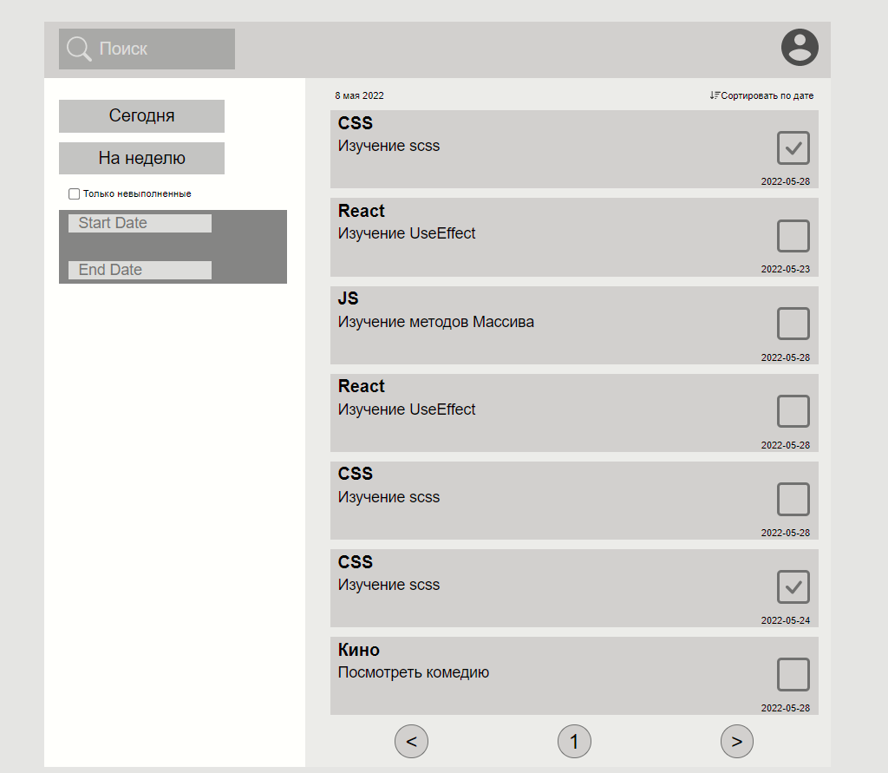
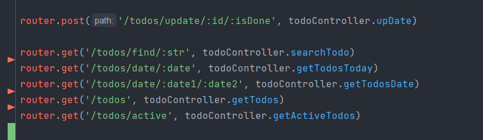

# Задание 3

## Седелано:

Сервер на express, БД postgres, запросы на сервер:

Для запуска сервера необходима скачать postgres и изменить данные для входа в файле env. При запуске сервер, конектиться
к БД и сразу создает таблицу с данными, при использовании dev режима он будет создавать данные при каждом обновлении.
Запуск осуществляеться, находясь в папке server в терминале командой

### `yarn dev`

## Так же сделал:

Popup, pagination, поиск по названию в БД, поиск по сегодняшнему дню, на неделю вперед
(только нужно изменить данные в таблице). Поиск в интервале дней.

Сделан локальный state с помощью redux куда вносяться данные с БД

Для запуска приложения нужно находиться в папке todo и в терменале ввести команду

### `yarn start`

Перед этим скачайте пакеты отдельно для server и todo

